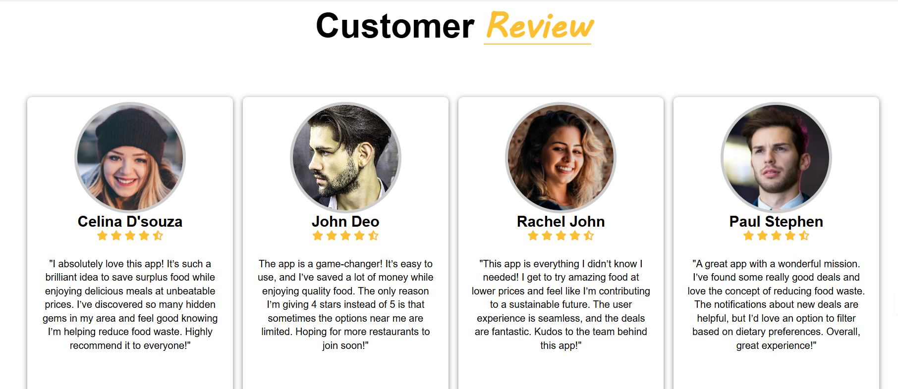

# FOOD 🎯


## Basic Details
### Team Name: Wonder Women


### Team Members
- Member 1: Grace John - SCMS Cochin School of Business
- Member 2: Gowri B - SCMS Cochin School of Business

### Hosted Project Link
https://gracejohn123.github.io/FOOD/
-
### Project Description
go-to platform for discovering amazing deals on surplus food from local restaurants and stores. Not only can you enjoy delicious meals and quality products at discounted prices, but you’re also contributing to reducing food waste and supporting a sustainable future. Where Smart Choices Meet Great Deals.

### The Problem 
In a world where approximately one-third of all food produced is wasted, millions of people face food insecurity daily, and businesses struggle to manage surplus inventory effectively. This contributes to environmental degradation, financial losses, and missed opportunities for community support. Despite growing awareness of sustainability, there is a lack of accessible, affordable, and rewarding platforms that bridge the gap between food waste reduction and consumer needs, leaving untapped potential for both local businesses and eco-conscious individuals.

### The Solution 
Introducing Food, the hero we didn’t know we needed. Imagine a world where every leftover biryani, extra loaf of garlic bread, or unsold box of brownies gets a second chance at happiness! With Food, we’re turning food waste into foodie treasure hunts.
## Technical Details
### Technologies/Components Used
For Software:
- HTML, CSS, JAVA SCRIPT
- Visual Studio, GitHub

### Implementation
For Software:
# Installation
This project is built using **HTML, CSS, and JavaScript**, and does not require additional installation. To set up the project locally, follow these steps:

1. **Download or Clone the Repository:**
   ```sh
   git clone https://github.com/gracejohn123/FOOD.git 
   ```
2. **Navigate to the Project Directory:**
   ```sh
   cd FOOD  
   ```
3. **Open the Project in a Code Editor (Optional):**  
   If you’re using **VS Code**, open the project by running:  
   ```sh
   code .  
   ```

### **Run**
To run the project, follow these steps:

1. Open the `index.html` file in a web browser manually, or use the following command if you have **Live Server** installed in VS Code:
   ```sh
   # Run Live Server (VS Code Extension)
   ```
   - If using **Live Server**, right-click `index.html` and select **"Open with Live Server"**.

2. If using a simple file path, double-click `index.html` to open it in your browser.

3. To debug or test the **cart functionality**, ensure that `Cart.html` is accessible through the browser.

### Project Documentation
For Software:

# Screenshots 





## Team Contributions
- Grace John: Platform Development & User Interface, Technical Integrations
- Gowri B: Concept Development & Market Research, Frontend Content Integration
